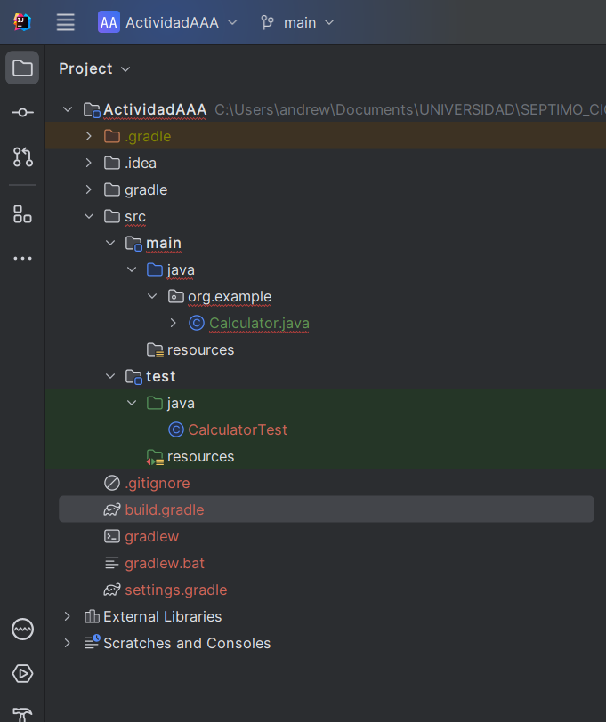
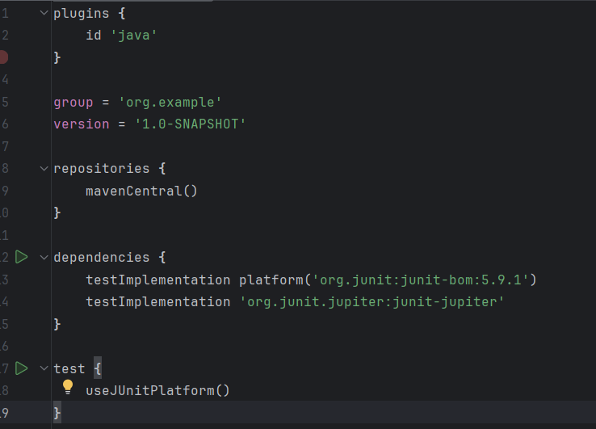
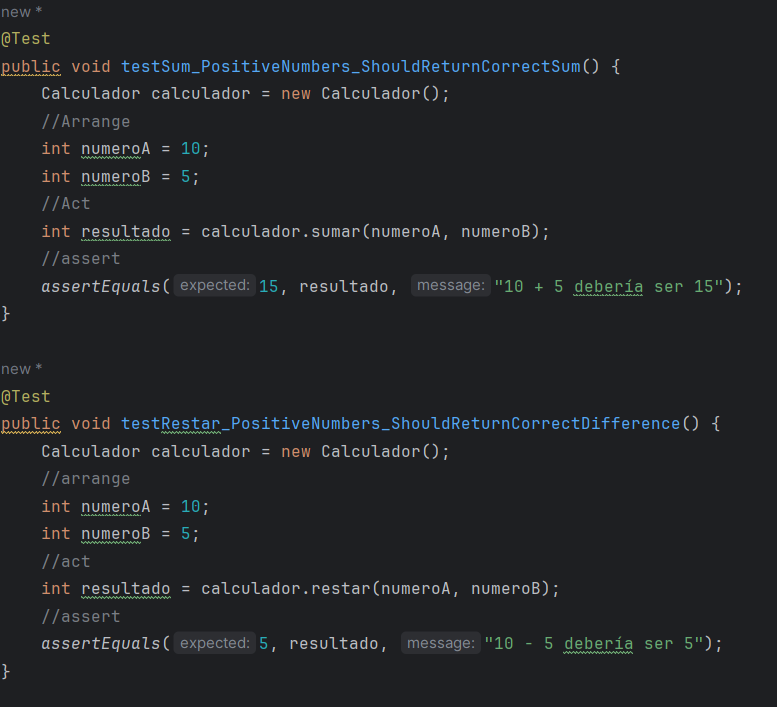
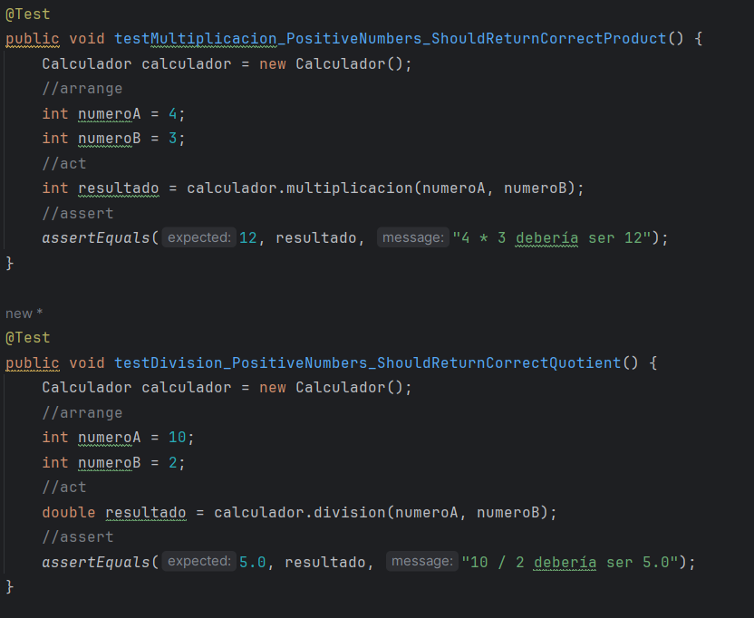
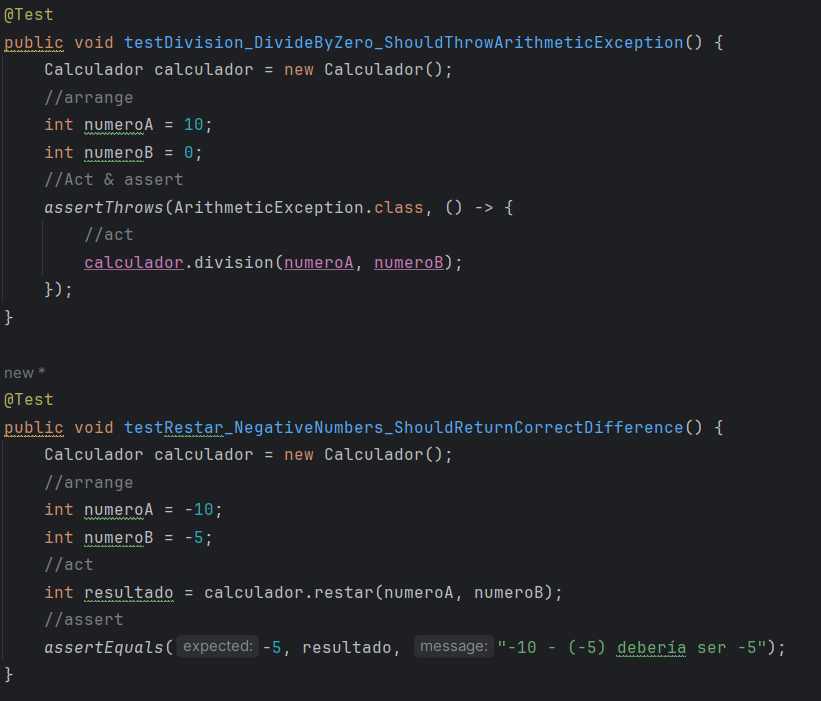
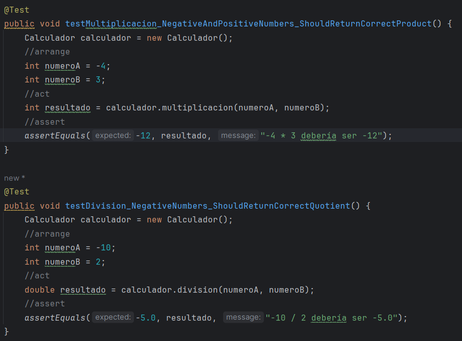
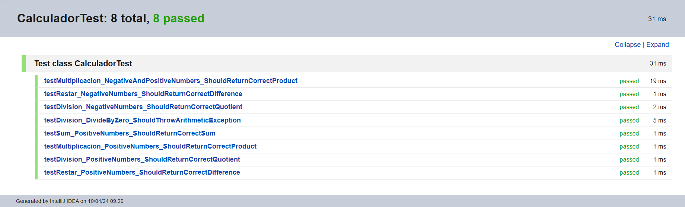

# Actividad AAA 
- Nombre y Apellidos : Andrei Steven Trujillo Armas 
## Paso 1: 
- Abrimos el IntelliJ IDEA y seleccionamos "File" > "New" > "Project".
- En el asistente de nuevo proyecto, elegimos "Gradle" como tipo de proyecto y como lenguaje de programacion seleccionamos "Java".
- Le ponemos nombre al proyecto (ActividadAAA) y seleccionamos un directorio donde se guardara el proyecto.
IntelliJ IDEA genera automáticamente los archivos necesarios para un proyecto tipo Gradle el cual incluye el archivo build.gradle con la configuración del proyecto.
- En el panel izquierdo de IntelliJ IDEA, se puede observar la estructura básica del proyecto, incluyendo las carpetas src con los directorios main y test para el código fuente y las pruebas unitarias, respectivamente.

- En el archivo build.gradle agregamos las dependencias para usar JUnit 5. Esto asegura que el proyecto pueda utilizar JUnit 5 para las pruebas unitarias.

## Paso 2 
- Se implementando la clase Calculador en el directorio src/main/java y la clase _CalculatorTest_ de las pruebas unitarias en el directorio src/test/java.

- Creamos las pruebas unitarias para los metodos de la clase _Calculator_ , cuyos metodos son las operaciones de la suma,resta,multiplicacion y division tomando en cuenta casos exclusivos como la division sobre cero .
- Capturamos excepciones para casos cuando un numero sea dividido entre 0.
  
  
  
  
- Realizamos la pruebas unitarias :
  